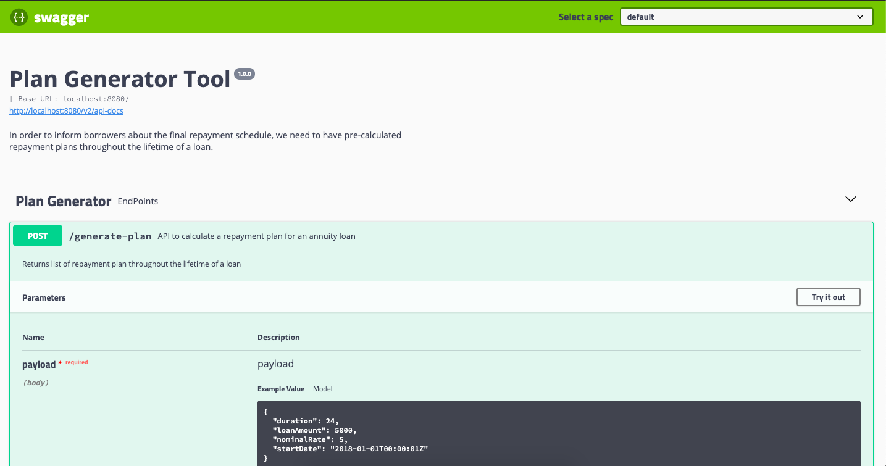

# plan-generator
In order to inform borrowers about the final repayment schedule, we need to have pre-calculated repayment plans throughout the lifetime of a loan

# Stack Used
Java 8  
Spring Boot  
Maven  
Docker

# Setup

Ensure docker installed in your machine 
Pull this repository and goto the application folder 
Run **docker-compose up** and wait untill application get started 
Goto **http://localhost:8080/swagger-ui.html** and check plan-generator service functionality 
Check **https://www.thecalculatorsite.com/finance/calculators/loancalculator.php** for result verification 

Sample:

